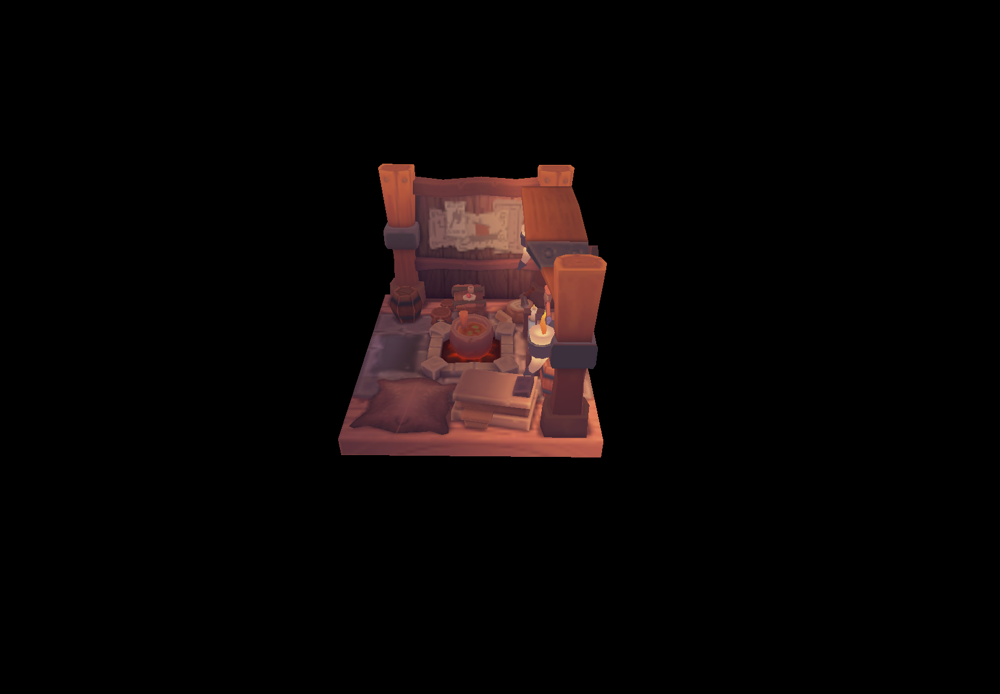

## What's this repo?
Prove where I'm learning `Vulkan` step by step. 

## How to play?
Clone the repo with the following command:

~~~ shell
git clone git@github.com:ILoveU3D/vkLearning.git
cd vkLearning
~~~

Then run this command to build & start this demo:
~~~ shell
sh run.sh 3
~~~

(Optional) If you want to debug with `GDB`, run this command:
~~~ shell
sh debug.sh 3
~~~

## You can see...
if all things goes rightly, you can see the rotated *Vking's room*:

## What's more
* Now this demo is so simple and only be tested on Ubuntu platform.
* It seems to have some bugs where this program can only run for a few second...